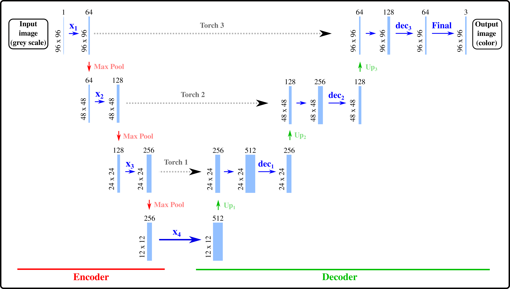

# PyTorch Image Colorizer with U-Net Architecture

This repository provides a PyTorch-based implementation of a convolutional neural network (CNN) for automatic image colorization using a U-Net architecture. The model is trained to convert grayscale images into RGB using the [STL-10 dataset](https://cs.stanford.edu/~acoates/stl10/), which contains natural images at a resolution of 96×96 pixels.




<p align="center">
  
</p>

*U-Net architecture used in this project.*

## Project Overview

This project demonstrates how to:

- Build and train a U-Net-based CNN for end-to-end image colorization.
- Prepare grayscale input and RGB output pairs from STL-10 images.
- Apply early stopping, loss tracking, and model checkpointing.
- Run inference on new grayscale images using the trained model.


## Dependencies

- Python 3.8+
- PyTorch
- torchvision
- numpy
- Pillow
- matplotlib

Install them with:

```
pip install -r requirements.txt
```


## Model Architecture

The U-Net model is a fully convolutional encoder–decoder network often used for image-to-image tasks. It consists of:

- Downsampling blocks with convolutional layers and max-pooling.
- Upsampling blocks with transposed convolutions and skip connections.
- A final output layer producing 3-channel RGB predictions.


## Code Structure

```
.
├── classes/                 # Model definitions (UNetColorization96)
├── pytorch/
│   └── models/             # Saved models and training history
├── scripts/                # Training and inference scripts
│   ├── train_colorize_unet96.py
│   └── colorize_image.py
```

## How to Use

### Train the Model

```
cd scripts
python train_colorize_unet96.py
```

This script will train the U-Net model and save:

- The best-performing model: `colorizer_model_unet96_best.pth`
- The training history: `colorizer_training_history_unet96.pkl`

### Run Inference

```
python scripts/colorize_image.py \
    --input path/to/grayscale_image.png \
    --output path/to/output_colorized.png \
    --model models/colorizer_model_unet96_best.pth
```

## Visualizing Loss over Training Epochs

You can visualize training and validation loss curves using the provided utilities.

```
python3 scripts/plot_loss.py --history model/colorizer_training_history_unet96.pkl
```


## License

GEOM is licensed under the **GNU General Public License v3.0**.

## Contact

For issues or contributions:

- Email: **pgrobasillobre@gmail.com**
- Github issues: https://github.com/pgrobasillobre/pytorch-image-colorizer/issues
